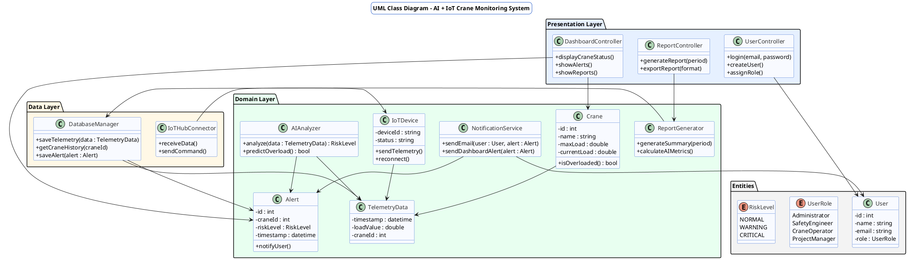

# UML-діаграма класів та опис відповідності принципам SOLID

---

## Загальна архітектура

Система розбита на три рівні:

* **Presentation Layer (UI / Web)** — компоненти для взаємодії з користувачем;
* **Domain Layer (Business Logic)** — логіка моніторингу, AI-аналізу, оповіщення;
* **Data Layer (IoT & Storage)** — сенсори, сховище даних, зв’язок із Azure.

---

## UML-Діаграма класів



---

## Пояснення основних класів

| Клас                                                        | Призначення                                  | Основні методи                                         |
| ----------------------------------------------------------- | -------------------------------------------- | ------------------------------------------------------ |
| **Crane**                                                   | Представляє кран на будмайданчику.           | `isOverloaded()` — визначає, чи перевищено ліміт.      |
| **IoTDevice**                                               | Модель сенсора, що передає дані в систему.   | `sendTelemetry()`, `reconnect()`.                      |
| **TelemetryData**                                           | Телеметрія (вага, час, стан).                | зберігається у БД.                                     |
| **AIAnalyzer**                                              | Модуль машинного навчання для оцінки ризику. | `analyze()`, `predictOverload()`.                      |
| **Alert**                                                   | Оповіщення про критичний стан.               | `notifyUser()` — відправляє через NotificationService. |
| **NotificationService**                                     | Відправка email, push-сповіщень.             | `sendEmail()`, `sendDashboardAlert()`.                 |
| **DatabaseManager**                                         | Доступ до сховища даних (SQL, Blob).         | `saveTelemetry()`, `getCraneHistory()`.                |
| **IoTHubConnector**                                         | Комунікація з Azure IoT Hub.                 | `receiveData()`, `sendCommand()`.                      |
| **ReportGenerator**                                         | Формує звіти для Project Manager.            | `generateSummary()`, `calculateAIMetrics()`.           |
| **DashboardController / ReportController / UserController** | Контролери UI-рівня (MVC).                   | відображення та взаємодія з користувачами.             |

---

## Відповідність принципам SOLID

| Принцип                       | Реалізація в проєкті                                                                                                                                      |
| ----------------------------- | --------------------------------------------------------------------------------------------------------------------------------------------------------- |
| **S — Single Responsibility** | Кожен клас відповідає лише за одну частину логіки: `Crane` — модель об’єкта, `AIAnalyzer` — лише аналіз даних, `NotificationService` — тільки сповіщення. |
| **O — Open/Closed**           | Нові типи сповіщень чи AI-алгоритмів можна додавати, не змінюючи існуючі класи.                                                                           |
| **L — Liskov Substitution**   | Можна розширювати класи `NotificationService` або `DatabaseManager`, не порушуючи функціональності.                                                       |
| **I — Interface Segregation** | Взаємодія між шарами через окремі інтерфейси (`IAnalyzer`, `IRepository`, `INotifier` — потенційно для розширення).                                       |
| **D — Dependency Inversion**  | Контролери не створюють екземпляри напряму — вони отримують сервіси (`AIAnalyzer`, `DatabaseManager`) через ін’єкцію залежностей (DI).                    |

---

## Логічне групування компонентів

```
- Entities (User, Crane, Alert, TelemetryData)
- Services (AIAnalyzer, NotificationService, ReportGenerator)
- Data Access (DatabaseManager, IoTHubConnector)
- Presentation Controllers (DashboardController, UserController, ReportController)
```
