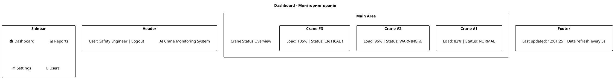
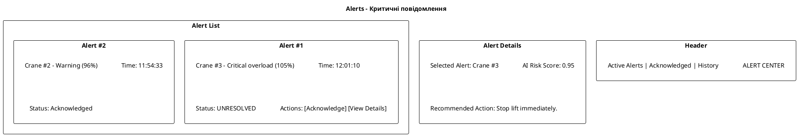
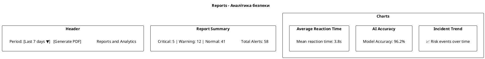
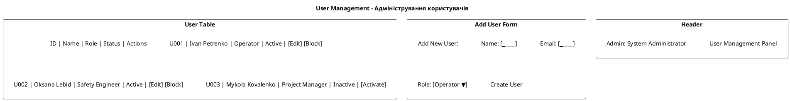
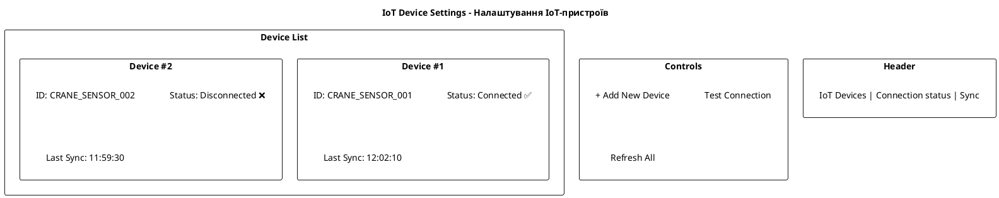

# Горизонтальні прототипи інтерфейсу системи (PlantUML)

---

## Прототип 1 — Головна панель моніторингу (Dashboard)

**Опис:**
Інженер з техніки безпеки бачить список кранів, поточне навантаження, статуси IoT-зв’язку та ризики від AI.

---

## Прототип 2 — Вікно сповіщень (Alerts & Notifications)

**Опис:**
Оператор крана або інженер отримує візуальні сповіщення про перевантаження та може підтвердити, що ознайомився з ними.

---

## Прототип 3 — Сторінка звітів і аналітики (Reports)

**Опис:**
Керівник проєкту формує звіт про інциденти, бачить графіки безпеки та метрики точності AI.

---

## Прототип 4 — Керування користувачами (User Management)

**Опис:**
Адміністратор додає користувачів, задає ролі доступу, блокує чи активує облікові записи.

---

## Прототип 5 — Налаштування IoT-пристроїв (IoT Settings)

**Опис:**
Адміністратор може підключати або відключати сенсори, перевіряти статус зв’язку з Azure IoT Hub.

