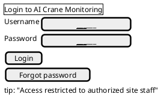
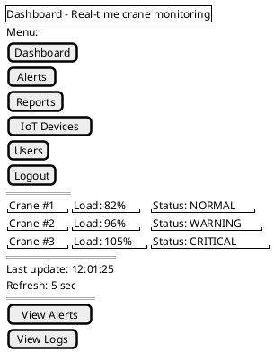
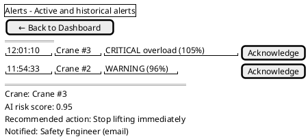
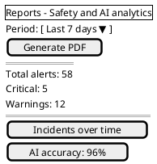
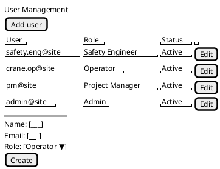
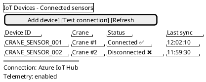

# Проєкт каркасу інтерфейсу користувача (Wireframes)

Мета: показати, **як різні ролі системи (інженер з ТБ, оператор, менеджер, адміністратор)** взаємодіють з веб-додатком моніторингу будівельних майданчиків, який виявляє ризик **перекидання крана через перевантаження**.

---

## 1. Wireframe: Екран входу (Login)

Це потрібно, бо в попередніх лабораторних ми ввели ролі (FR6: керування користувачами).

---

## 2. Wireframe: Dashboard (моніторинг у реальному часі)

Це головний екран, який реалізує FR1, FR2, FR3, FR7 і наші User Stories з ЛР4 (US1.1, US2.1, US3.1).

Тут ми явно показали:

* оновлення в реальному часі (NFR7),
* різні статуси (зелений/жовтий/червоний із NFR18),
* навігацію на Alerts.

---

## 3. Wireframe: Alerts (центр сповіщень)

Цей екран напряму відповідає FR7 і US3.1 (оператор отримує миттєве сповіщення).

---

## 4. Wireframe: Reports (аналітика та звіти)

Це з ЛР2 (Use Case UC-05, UC-06) і з FR5/NFR12 з ЛР3.

---

## 5. Wireframe: User Management (для Admin)

Це реалізація FR6 (керування користувачами та ролями) з ЛР3 і нашого UC-07 з ЛР2.

---

## 6. Wireframe: IoT Devices (підключення сенсорів)

Це те, що ми вже вводили в ЛР2 (UC-08) і що вимагається завданням (бо система працює з Azure IoT Hub).

