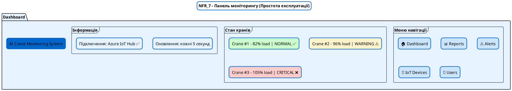
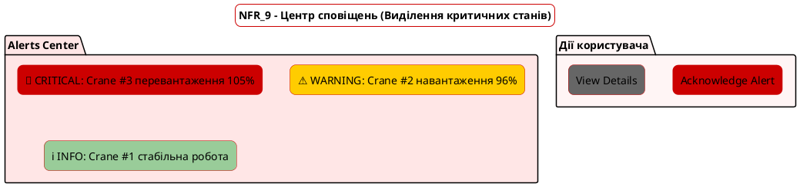
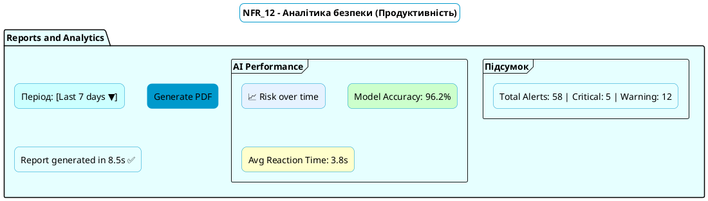
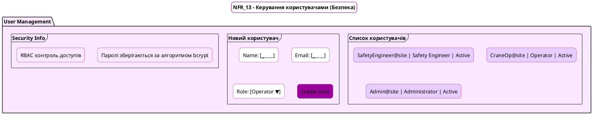
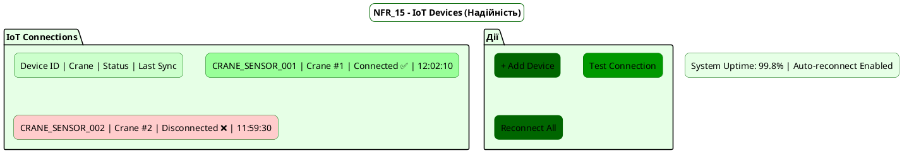
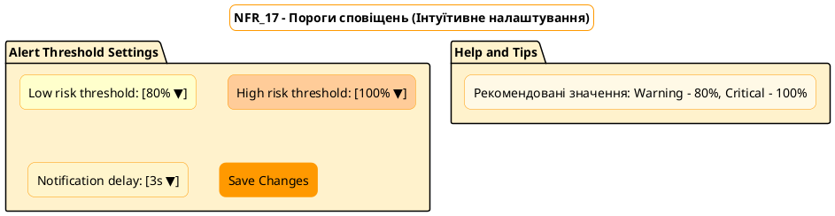

# Проєкт макетів інтерфейсу користувача (Mockups)

---

## **NFR_7 – Простота експлуатації (Usability)**

**Екран:** Dashboard
**Принцип:** мінімалізм, зручність, зосередження на ключовій інформації.

---

## **NFR_9 – Візуальне виділення критичних станів**

**Екран:** Alerts
**Принцип:** миттєве розпізнавання небезпеки.

---

## **NFR_12 – Продуктивність системи**

**Екран:** Reports
**Принцип:** швидке завантаження, чіткі графіки, мінімум відволікань.

---

## **NFR_13 – Безпека користувачів і доступу (Security)**

**Екран:** User Management
**Принцип:** чітка рольова структура, шифрування, контроль прав.

---

## **NFR_15 – Надійність системи (Availability ≥ 99.5%)**

**Екран:** IoT Devices
**Принцип:** моніторинг доступності, статуси підключень, швидке відновлення.

---

## **NFR_17 – Інтуїтивне налаштування порогів сповіщення (Ease of configuration)**

**Екран:** Alert Settings
**Принцип:** інтуїтивність, простота введення, кольорова індикація рівнів ризику.

---

## Підсумкова таблиця

| Макет                  | NFR | Екран          | Основний принцип           | Колірна тема               |
| ---------------------- | --- | -------------- | -------------------------- | -------------------------- |
| NFR_7_Dashboard        | 7   | Dashboard      | Простота, зрозумілість     | Блакитна (успокійлива)     |
| NFR_9_Alerts           | 9   | Alerts         | Виділення ризиків          | Червона (тривога)          |
| NFR_12_Reports         | 12  | Reports        | Продуктивність, швидкість  | Бірюзова (аналітика)       |
| NFR_13_UserManagement  | 13  | Users          | Безпека, контроль доступів | Фіолетова (авторитетність) |
| NFR_15_IoTDevices      | 15  | IoT Devices    | Надійність, стабільність   | Зелена (стійкість)         |
| NFR_17_AlertThresholds | 17  | Alert Settings | Інтуїтивність, простота    | Помаранчева (налаштування) |

---